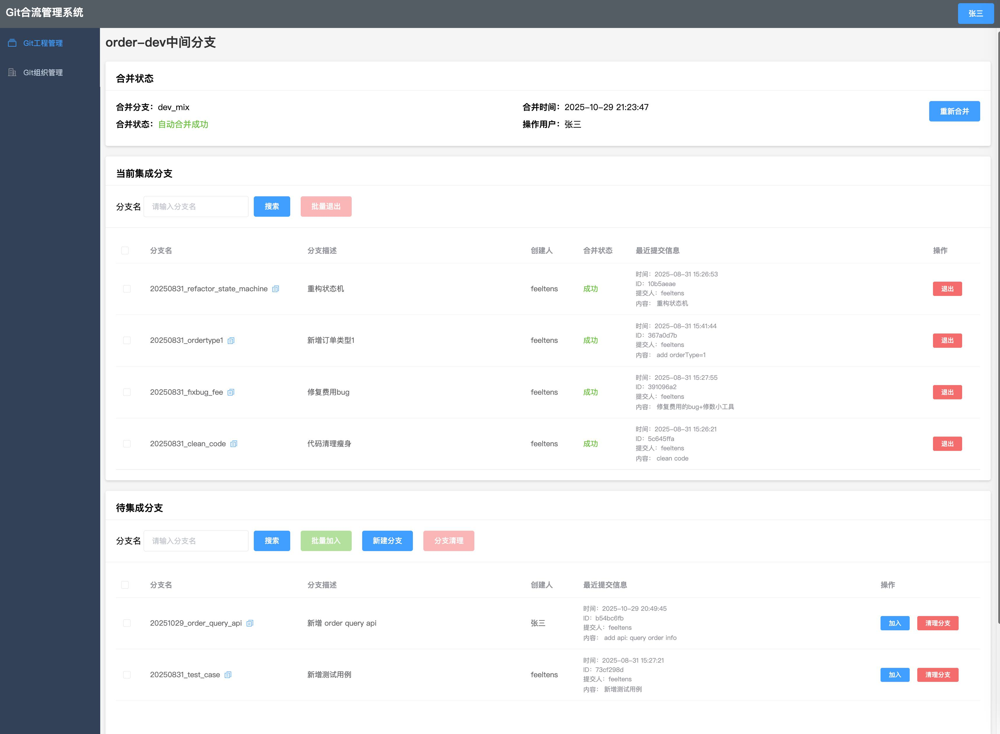
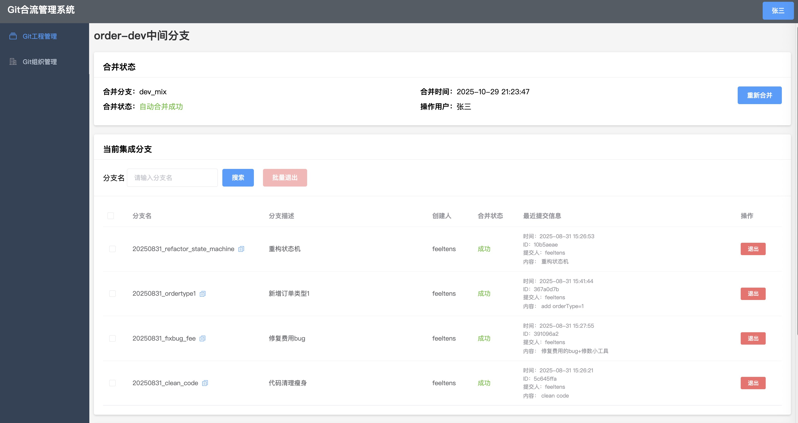
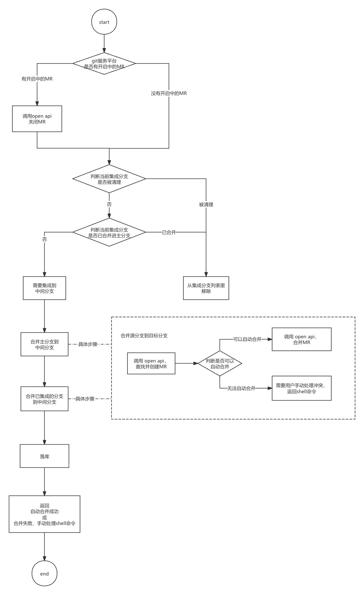

<div align="center">
  <h1>🌊 git-merge-flow</h1>
  <p><strong>合流管理系统 - Git 中间分支合并工具</strong></p>

  
  
  
  
  

  <p>
    <a href="#-功能特性">功能特性</a> •
    <a href="#-效果预览">效果预览</a> •
    <a href="#-快速开始">快速开始</a> •
    <a href="#-技术栈">技术栈</a> •
    <a href="#-qa">Q&A</a>
  </p>

  
</div>

---

## 📖 项目简介

**git-merge-flow**（合流管理系统）是一个基于 Spring Boot + Thymeleaf + Vue.js 的 Git 分支管理工具，专注于解决**多个开发分支共用同一测试环境**的痛点问题。

通过集成 GitLab 和阿里云 CodeUp 的官方 API，实现对中间分支的自动化管理，让团队协作更加高效。

### 💡 名称释义

**英文名 git-merge-flow**：
- **git**：管理对象
- **merge**：合并之义
- **flow**：每次【重新合并】都会把当前集成分支重新合并到中间分支，就像一段可持续的流程

**中文名【合流】**：
就像河流的各个分支汇聚到主干，git-merge-flow 的核心功能就是合并 git 分支到中间分支（主干河流）

### 🎯 应用场景

在降本增效的趋势下，企业或团队往往面临：
- ✅ 多个需求并行开发
- ✅ 多个代码分支同时存在
- ✅ 多个测试任务并行执行
- ❌ 但各个环境只会部署一套

**git-merge-flow** 解决了手动合并多个分支到中间分支的繁琐操作，提升团队效率。

---

## ✨ 功能特性

- 🔀 **中间分支管理**：自动管理 dev_mix、test_mix、pre_mix 等中间分支
- 🔄 **一键重新合并**：核心功能，自动重新合并中间分支，保持与主分支最新代码一致，并依次合并所有分支
- 🌿 **分支操作**：新建分支、拉取远程分支、清理无效分支
- 🏢 **多工程支持**：支持管理多个 Git 工程
- 🔌 **多平台适配**：支持 GitLab (v18.3+) 和阿里云 CodeUp
- 📊 **可视化界面**：基于 Thymeleaf + Vue.js 的友好 Web 界面
- 🛠️ **冲突处理**：自动生成冲突处理脚本，简化手动解决流程
- 📝 **操作日志**：记录所有分支操作历史

---

## 🖼️ 效果预览

<div align="center">
  
  <p><em>主界面 - 中间分支管理</em></p>
</div>

<details>
<summary>📸 点击查看更多截图</summary>

|            工程管理             | 分支管理 |
|:---------------------------:|:----:|
|  |      |

|           冲突手动处理            |        重新合并，无冲突，自动合并        |
|:---------------------------:|:---------------------------:|
|  |  |

</details>

**[查看完整效果图 →](system_show.md)**

---

## 🔄 核心功能：重新合并

**重新合并**是 git-merge-flow 最重要的功能

<div align="center">
  
  <p><em>重新合并内部方法逻辑</em></p>
</div>

---

## 🚀 快速开始

### 📋 环境要求

| 软件 | 版本要求 |
|:---:|:---:|
| JDK | 1.8+ |
| MySQL | 8.0+ |
| Maven | 3.6+ |

### 1️⃣ 数据库初始化

创建数据库并执行初始化脚本：

```bash
# 1. 创建数据库
mysql -u root -p
CREATE DATABASE git_merge_flow DEFAULT CHARACTER SET utf8mb4 COLLATE utf8mb4_unicode_ci;

# 2. 导入表结构
mysql -u root -p git_merge_flow < doc/sql/git_merge_flow.sql
```

### 2️⃣ 获取 Git API 访问令牌

<details>
<summary><b>GitLab 配置</b></summary>

访问您的 GitLab 实例获取个人访问令牌：

```
http://your-gitlab-domain/-/user_settings/personal_access_tokens
```

示例：`http://192.168.111.221/-/user_settings/personal_access_tokens`

需要勾选的权限范围：
- ✅ `api`
- ✅ `read_repository`
- ✅ `write_repository`

</details>

<details>
<summary><b>阿里云 CodeUp 配置</b></summary>

访问阿里云获取个人访问令牌：

```
https://account-devops.aliyun.com/settings/personalAccessToken
```

</details>

### 3️⃣ 配置文件

修改 `src/main/resources/application.yml`：

#### **数据库配置**

```yaml
spring:
  datasource:
    url: jdbc:mysql://localhost:3306/git_merge_flow?useUnicode=true&characterEncoding=utf8&useSSL=false&serverTimezone=Asia/Shanghai&allowPublicKeyRetrieval=true
    username: your_username
    password: your_password
```

#### **Git API 配置**

```yaml
merge-flow:
  # git服务提供方：gitlab 或 codeup
  gitService: gitlab

# GitLab API 配置
gitlab:
  api:
    baseUrl: http://your-gitlab-domain  # 例如：http://192.168.111.221
    accessToken: your-gitlab-access-token

# CodeUp API 配置
codeup:
  api:
    baseUrl: https://openapi-rdc.aliyuncs.com
    accessToken: your-codeup-access-token
```

### 4️⃣ 启动项目

<details>
<summary><b>方式一：Maven 运行</b></summary>

```bash
# 1. 编译打包
mvn clean package

# 2. 运行项目
java -jar target/git-merge-flow-1.0-SNAPSHOT.jar

# 或者直接运行（开发模式）
mvn spring-boot:run
```

</details>

<details>
<summary><b>方式二：命令行参数启动</b></summary>

适合生产环境，无需修改配置文件：

```bash
java -jar target/git-merge-flow-1.0-SNAPSHOT.jar \
  --merge-flow.gitService=gitlab \
  --gitlab.api.baseUrl=http://your-gitlab-domain \
  --gitlab.api.accessToken=your-gitlab-access-token \
  --codeup.api.accessToken=your-codeup-access-token
```

</details>

<details>
<summary><b>方式三：IDEA 启动（开发调试）</b></summary>

在 IDEA 的 Run/Debug Configurations 中添加 Program arguments：

```
--merge-flow.gitService=gitlab
--gitlab.api.baseUrl=http://your-gitlab-domain
--gitlab.api.accessToken=your-gitlab-access-token
--codeup.api.accessToken=your-codeup-access-token
```

</details>

### 5️⃣ 访问系统

浏览器访问：**http://localhost:18081**

首次使用时填写操作人即可开始使用 🎉


---

## 🛠️ 技术栈

| 类型 | 技术 |
|:---:|:---|
| **后端框架** | Spring Boot 2.2.1.RELEASE |
| **模板引擎** | Thymeleaf |
| **前端框架** | Vue.js 2.6 + Element UI 2.15 |
| **数据库** | MySQL 8.0 |
| **ORM 框架** | MyBatis |
| **构建工具** | Maven |
| **JDK 版本** | 1.8 |
| **Git API** | GitLab API v18.3+ / CodeUp OpenAPI |

---

## 📂 项目结构

```
git-merge-flow/
├── src/main/
│   ├── java/com/feeltens/git/
│   │   ├── GitMergeFlowApplication.java   # 主启动类
│   │   ├── common/                        # 公共组件
│   │   │   ├── constant/                  # 常量定义
│   │   │   └── exception/                 # 异常处理
│   │   ├── config/                        # 配置类
│   │   ├── controller/                    # 控制器层
│   │   ├── converter/                     # 对象转换器
│   │   ├── dto/                           # 数据传输对象
│   │   ├── entity/                        # 实体类
│   │   ├── enums/                         # 枚举类
│   │   ├── mapper/                        # MyBatis Mapper
│   │   ├── oapi/                          # OpenAPI 适配器
│   │   ├── service/                       # 服务层
│   │   ├── util/                          # 工具类
│   │   └── vo/                            # 视图对象
│   └── resources/
│       ├── mapper/                        # MyBatis XML映射
│       ├── templates/                     # Thymeleaf模板
│       ├── static/                        # 静态资源
│       └── application.yml                # 配置文件
└── doc/
    ├── img/                               # 效果图
    └── sql/                               # 数据库脚本
```

---

## 💾 数据库表结构

| 表名 | 说明 |
|:---|:---|
| `git_organization` | Git 组织表 |
| `git_project` | Git 工程表 |
| `git_branch` | Git 原始分支表 |
| `git_mix_branch` | Git 中间分支表 |
| `git_mix_branch_item` | Git 中间分支条目表（记录哪些分支合并到中间分支） |

详细表结构请参考：[`doc/sql/git_merge_flow.sql`](doc/sql/git_merge_flow.sql)

---

## ❓ Q&A

<details>
<summary><b>1. git-merge-flow 的定位是什么？</b></summary>

**定位**：管理多个 Git 工程、多个环境、多个分支的中间分支，专门解决多个分支部署在同一环境的问题。

**核心理念**：`小而美的工具`，而非功能臃肿的大而全系统。

**解决痛点**：`多个分支共用同一套环境`

**应用场景**：
- 企业或团队在降本增效趋势下的实际需求
- 多个需求并行、多个代码分支、多个测试任务并行
- 但各个环境只会部署一套的情况

**二次开发**：基于开源协议，可集成 Jenkins、钉钉、邮件通知等，实现完整的 CI/CD 流程。

例如：在 `GitFlowService#remergeMixBranch` 方法后，通过 Spring 事件机制，触发 Jenkins 自动部署。

示例：
调用 git-merge-flow 的 dev_jenkins 分支的 com.feeltens.git.controller.JenkinsController#testJenkins （使用api重新部署jenkins），这样就实现了【重新合并中间分支 -> 重新部署jenkins】的简单CI/CD功能。

</details>

<details>
<summary><b>2. 是否支持其他 Git 服务平台（如 GitHub）？</b></summary>

**暂不考虑。**

原因分析：
- 🏢 **GitLab**：大部分企业的首选方案（自建私有仓库）
- ☁️ **CodeUp**：不想自建 Git 服务的第二选择（阿里云托管）
- 🌐 **GitHub**：主要用于开源项目，较少出现多分支合并场景

如有强烈需求，欢迎提交 PR 贡献代码！

</details>

<details>
<summary><b>3. 支持哪些环境？可以自定义吗？</b></summary>

默认支持环境：`dev`、`test`、`pre`

**自定义方法**：
修改 `com.feeltens.git.enums.EnvEnum` 枚举类，根据实际需求增删改环境类型。

</details>

<details>
<summary><b>4. 中间分支命名规则可以修改吗？</b></summary>

**完全可以！** 默认命名：`dev_mix`、`test_mix`、`pre_mix`

**修改位置**：
`com.feeltens.git.service.impl.GitFlowServiceImpl.getMixBranchName()`

</details>

<details>
<summary><b>5. 为什么需要【Git 组织管理】模块？</b></summary>

因为阿里云 CodeUp 允许同一用户归属不同的 Git 组织。

为了统一 GitLab 和 CodeUp 的数据模型，添加了【Git 组织】概念。

**注意**：在 git-merge-flow 的设计中，GitLab 默认的组织名是 `default`。

</details>

<details>
<summary><b>6. 为什么没有登录功能，只需填写操作人？</b></summary>

**设计理念**：专注于解决中间分支合并问题的小而美工具。

**当前做法**：简单填写操作人用于记录操作日志。

**扩展性**：
- ✅ 可自行添加登录、权限管理功能
- ✅ 可自行添加操作审计功能
- ✅ 适合企业内网使用，安全性由网络隔离保障

</details>

---

## 📚 参考资料

- [GitLab REST API (v18.3)](https://docs.gitlab.com/18.3/api/rest/)
- [阿里云云效 CodeUp OpenAPI](https://help.aliyun.com/zh/yunxiao/developer-reference/codeup/)
- Favicon 来源于 Araxis Merge 软件

---

## 📄 开源许可证

本项目基于 **[GPL-3.0](LICENSE)** 协议开源。

---

## ⭐ Star History

如果这个项目对您有帮助，请给个 Star ⭐ 支持一下！

<div align="center">
  <p>Made with ❤️ by feeltens</p>
  <p>Copyright © 2025 git-merge-flow</p>
</div>
