# 效果图

## 主界面：
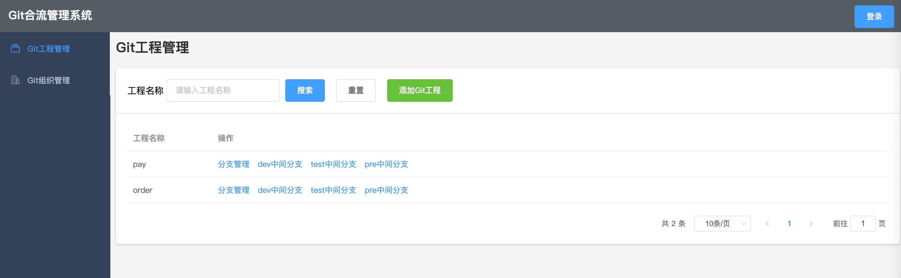

填写操作人：
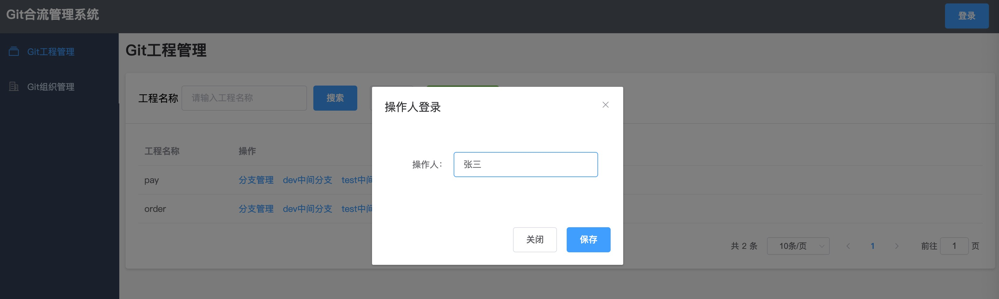

## Git组织管理：
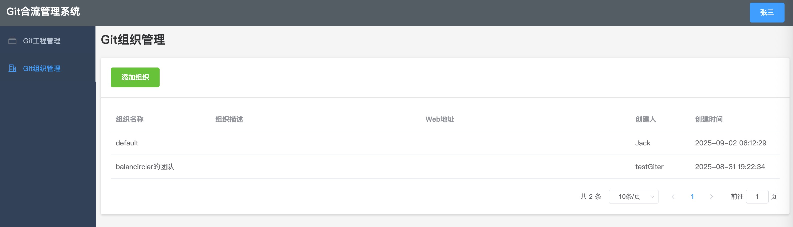

## Git工程管理：
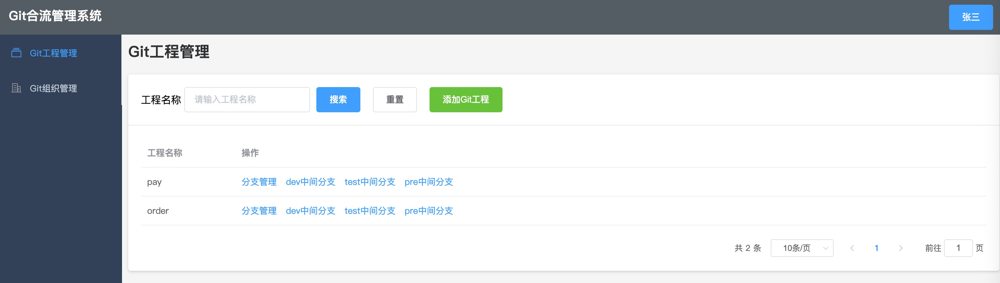

添加Git工程：
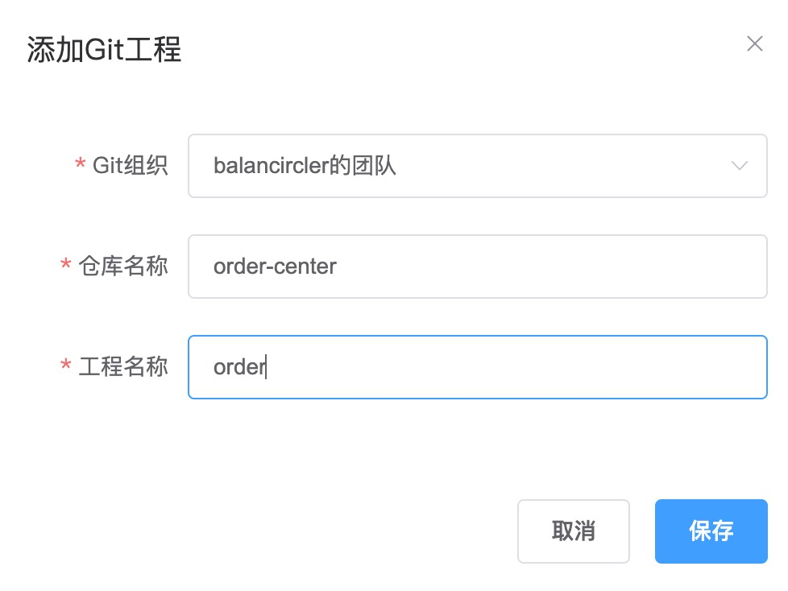

## Git分支管理：新建分支、拉取远程分支、清理分支
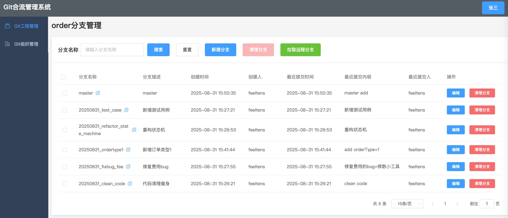

新建Git分支：
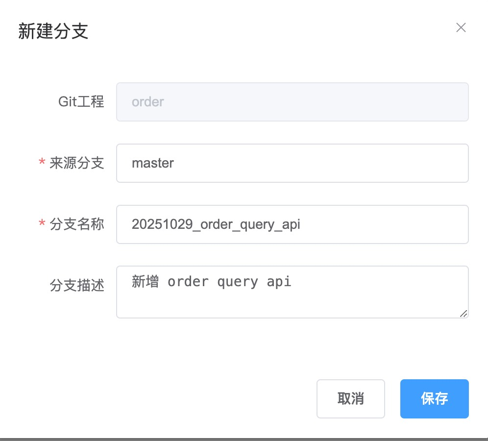

## Git中间分支管理：
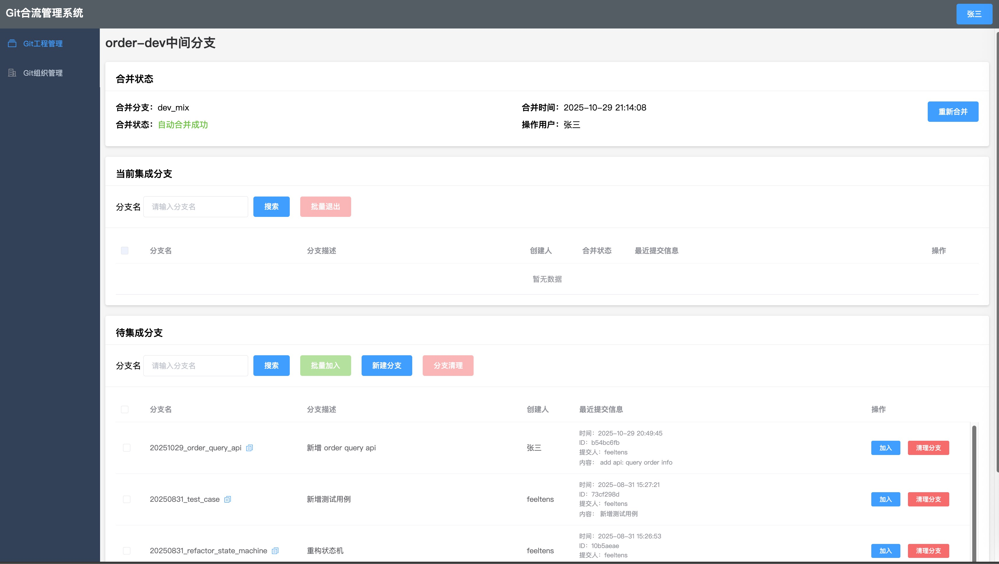

### 添加分支到中间分支：
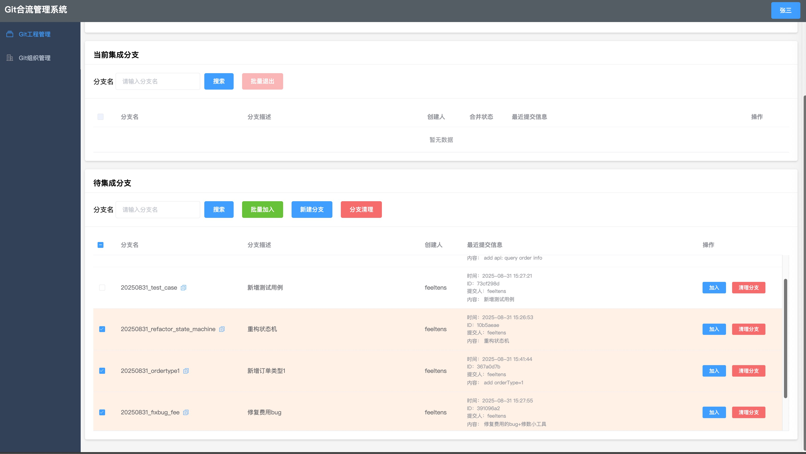

### 自动合并失败，需要手动处理冲突：
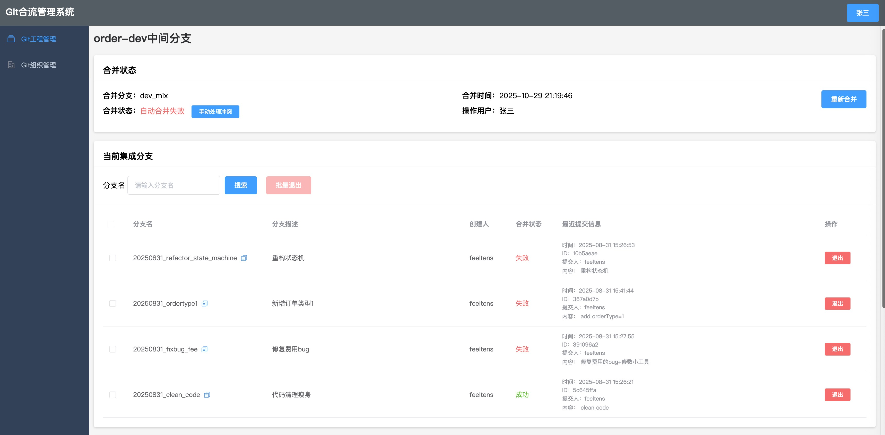

### 手动处理冲突shell脚本：
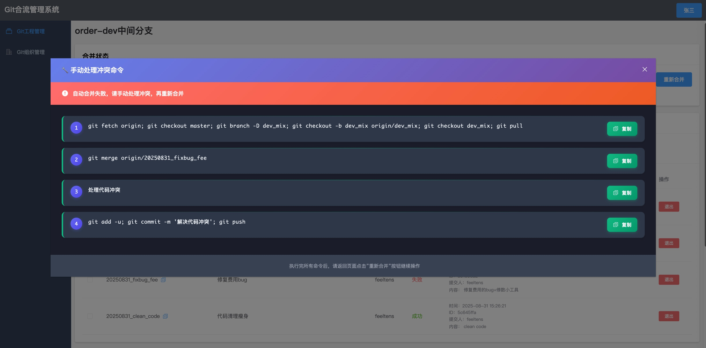

### 从中间分支退出分支：  
注意，这将重建中间分支，然后把当前集成的分支列表依次逐一合并到中间分支里，可能需要重新处理代码冲突！

