

  <h1>🖼️ 系统效果图</h1>
  
<strong>git-merge-flow 功能演示</strong>

  
📸 完整的系统截图展示

---

## 📑 目录导航

| 模块 | 说明 |
|:---|:---|
| [🏠 主界面](#-主界面) | 系统首页与登录 |
| [🏢 Git 组织管理](#-git-组织管理) | 管理 GitLab/CodeUp 组织 |
| [📦 Git 工程管理](#-git-工程管理) | 添加和管理 Git 项目 |
| [🌿 Git 分支管理](#-git-分支管理) | 分支的增删改查 |
| [🔀 Git 中间分支管理](#-git-中间分支管理) | 核心功能：合并多分支 |
| [🛠️ 冲突处理](#️-冲突处理) | Web 解决 / 手动处理 |
| [👥 用户管理](#-用户管理) | 用户与权限管理 |

---

## 🏠 主界面

  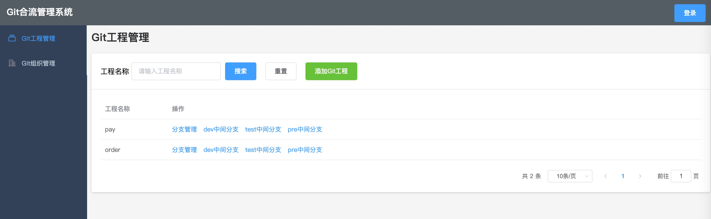
  
<em>📊 主界面 - 工程列表与中间分支入口</em>

### 🔐 用户登录

  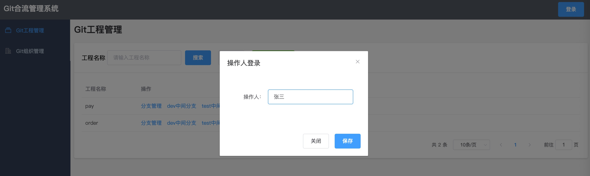
  
<em>🔑 登录界面 - 默认管理员 admin/admin123</em>

---

## 🏢 Git 组织管理

  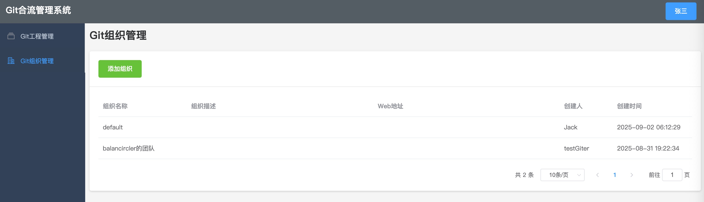
  
<em>🏢 组织管理 - 支持 GitLab 和阿里云 CodeUp</em>

> 💡 **说明**：组织是 Git 仓库的容器，一个组织下可以有多个仓库

---

## 📦 Git 工程管理

  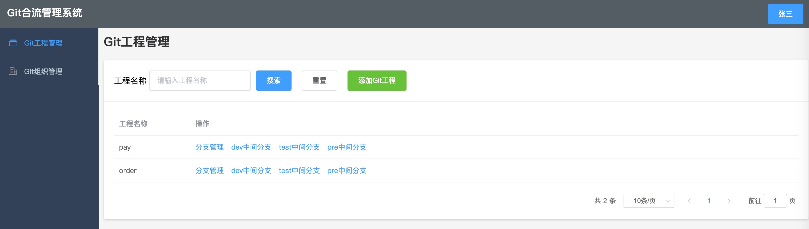
  
<em>📦 工程列表 - 展示所有已配置的 Git 项目</em>

### ➕ 添加 Git 工程

  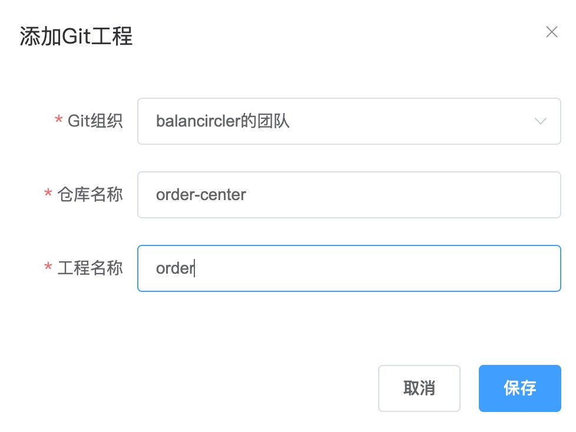
  
<em>➕ 添加工程 - 选择组织和仓库，设置工程名称</em>

---

## 🌿 Git 分支管理

  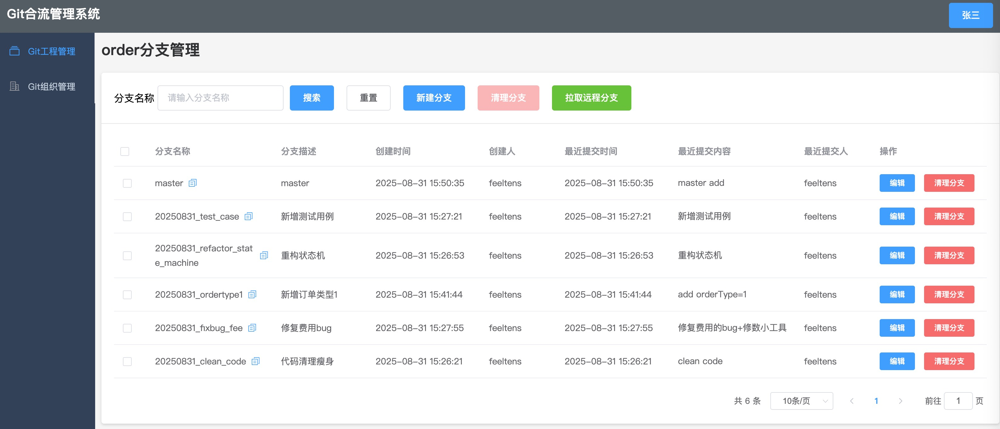
  
<em>🌿 分支管理 - 查看、新建、拉取、清理分支</em>

### ➕ 新建 Git 分支

  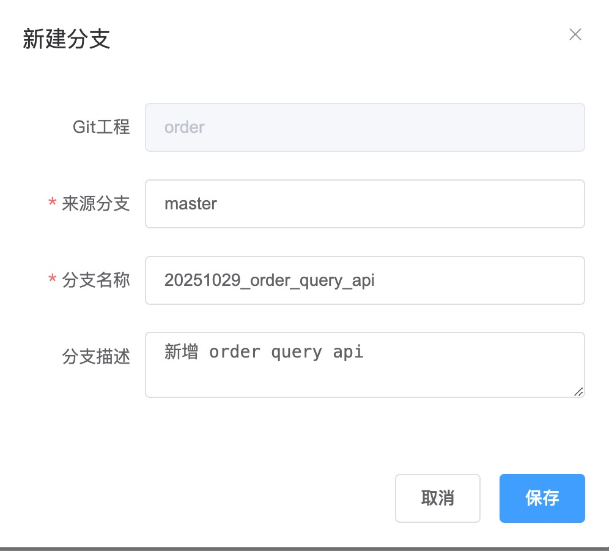
  
<em>🌱 新建分支 - 从指定分支创建新的开发分支</em>

---

## 🔀 Git 中间分支管理

  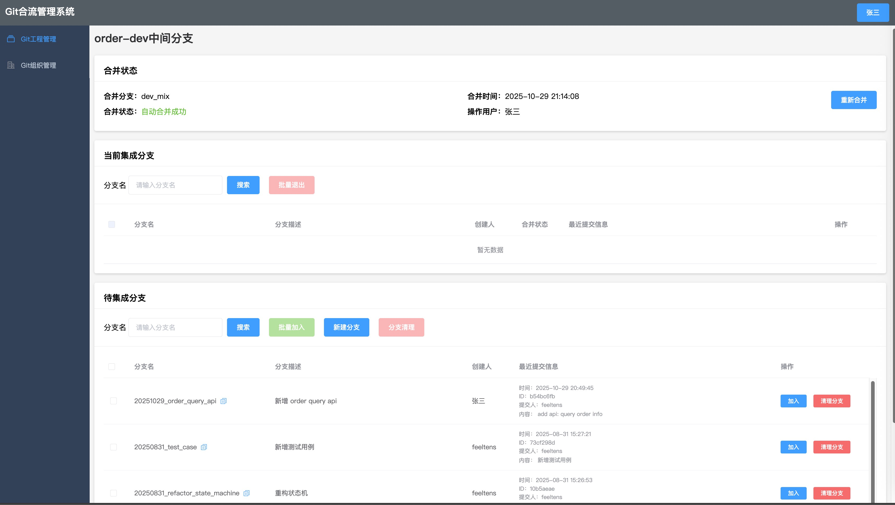
  
<em>🔀 中间分支详情 - 查看已合并和待合并的分支列表</em>

### ➕ 添加分支到中间分支

  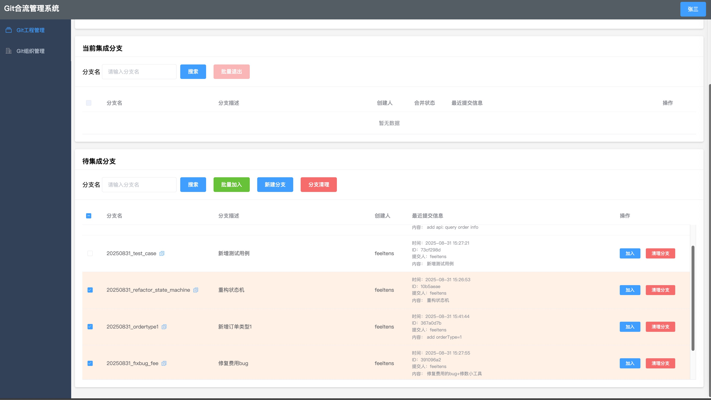
  
<em>➕ 添加分支 - 选择需要合并到中间分支的分支</em>

---

## 🛠️ 冲突处理

### ⚠️ 自动合并失败提示

  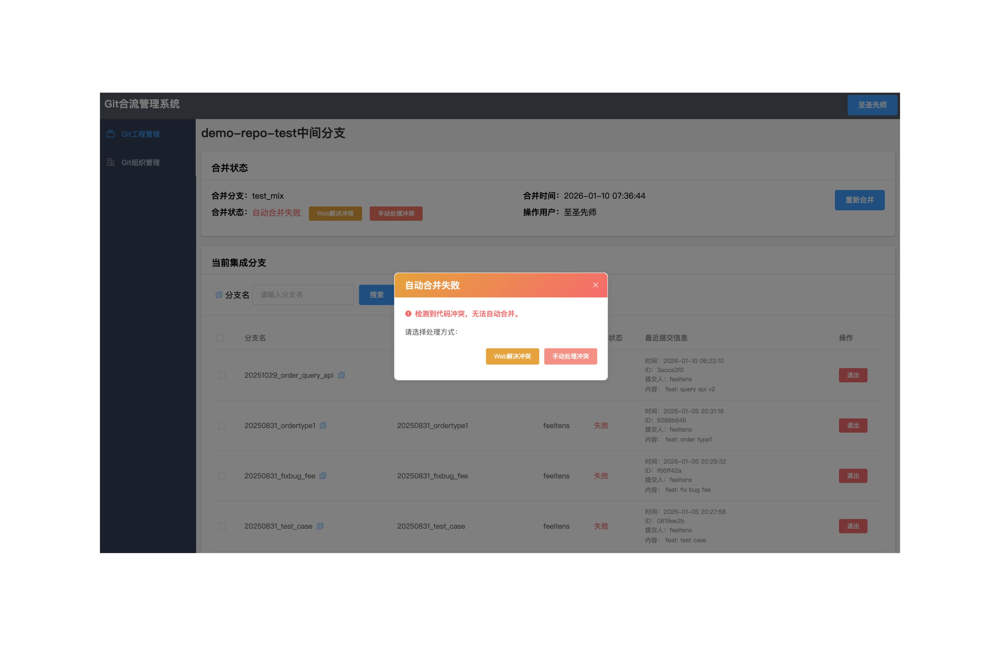
  
<em>⚠️ 冲突提示 - 提供【Web 解决冲突】和【手动处理冲突】两种方式</em>

### 🖥️ Web 在线解决冲突

  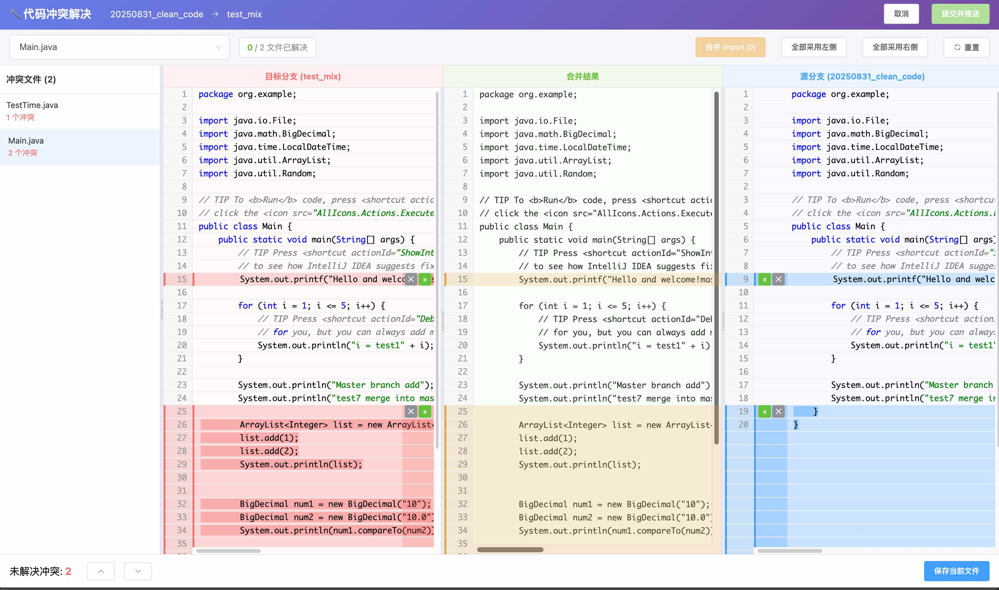
  
<em>🖥️ Web 冲突解决 - 类似 IDE 的三栏对比界面</em>

  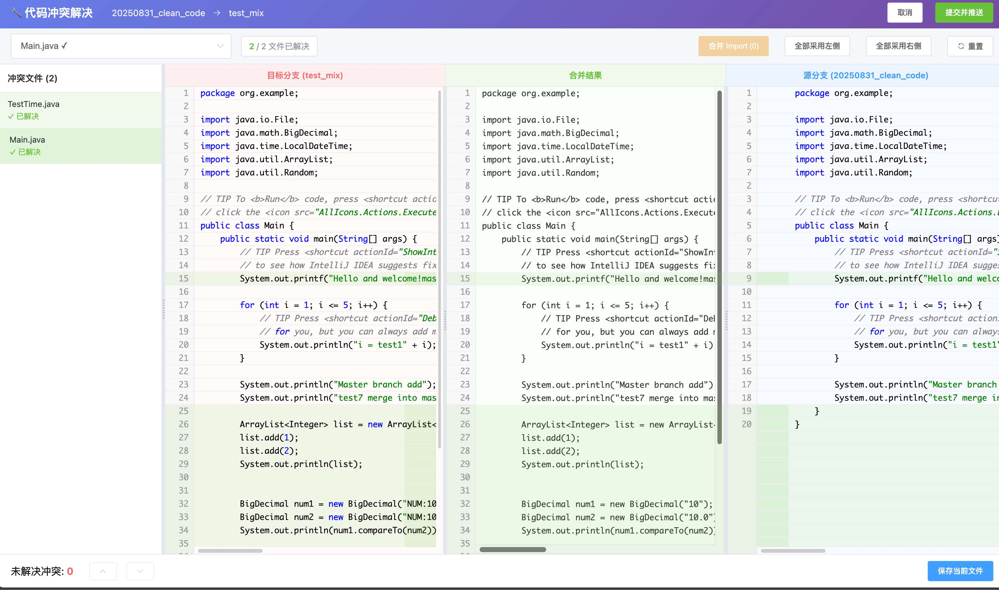
  
<em>✅ 解决完成 - 提交并推送代码</em>

### 📜 手动处理冲突脚本

  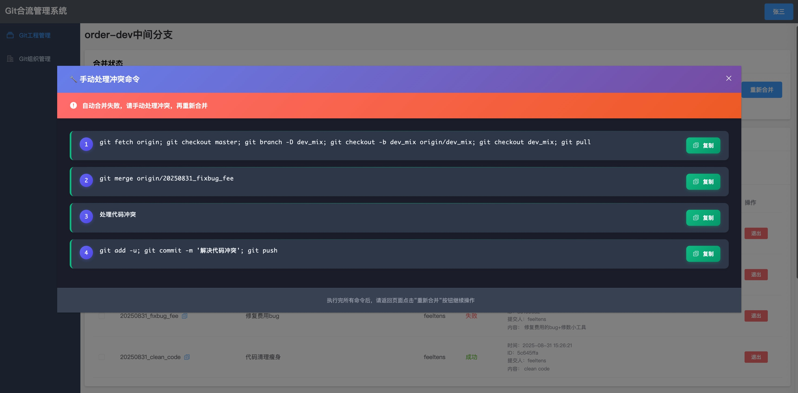
  
<em>📜 自动生成 Shell 脚本 - 复制到本地执行即可</em>

### ➖ 从中间分支移除分支

  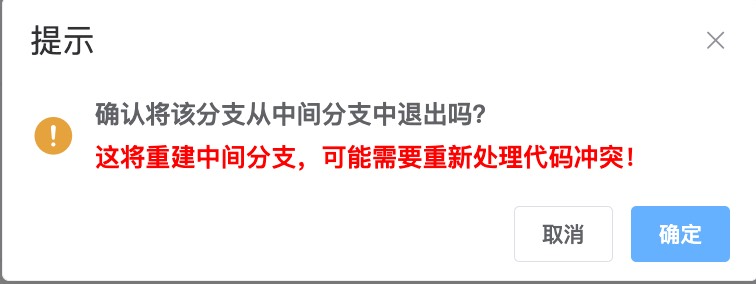
  
<em>➖ 移除分支 - 从中间分支中移除指定分支</em>

> ⚠️ **注意**：移除分支会触发重新合并，可能需要重新处理冲突！

---

## 👥 用户管理

### 📋 用户列表

  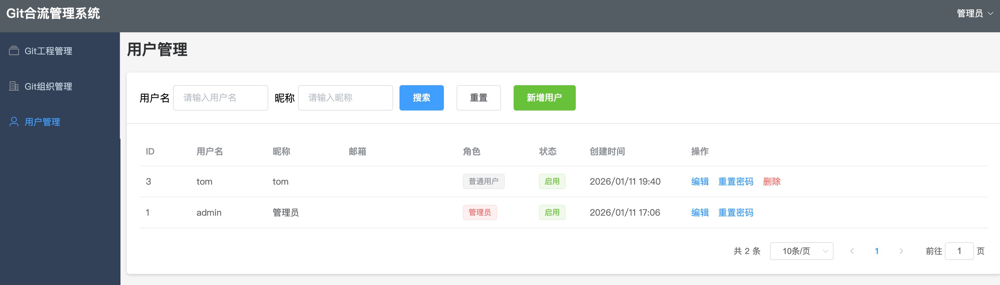
  
<em>👥 用户列表 - 管理系统用户</em>

### 🔐 用户权限分配

  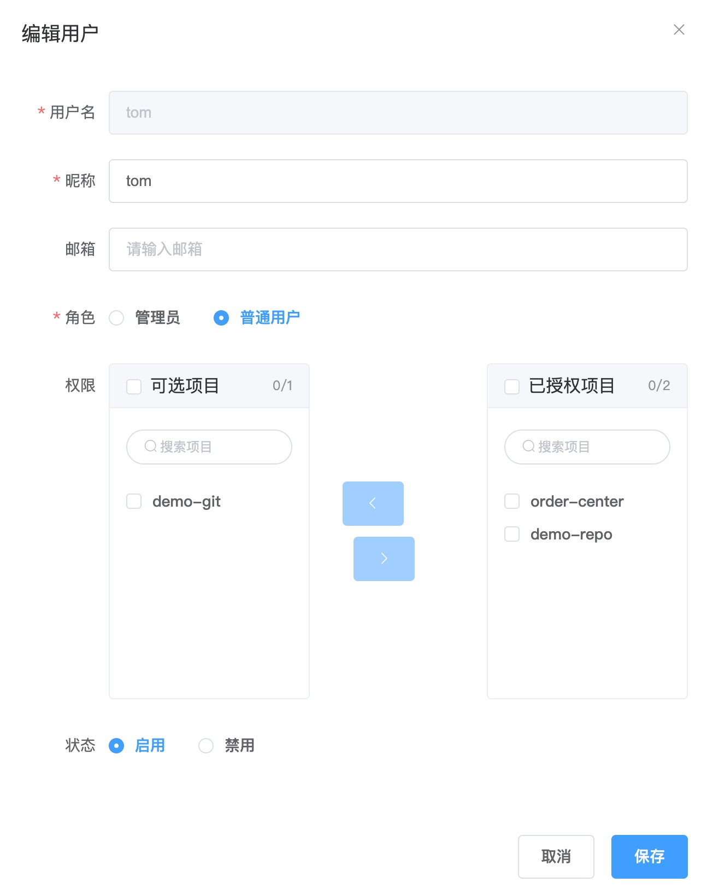
  
<em>🔐 权限分配 - 为用户分配可操作的 Git 工程</em>

---

## 📊 功能总览

| 模块 | 功能 | 说明 |
|:---|:---|:---|
| 🏢 组织管理 | 添加组织 | 管理 GitLab/CodeUp 组织 |
| 📦 工程管理 | 添加/查看工程 | 管理 Git 仓库 |
| 🌿 分支管理 | 新建/拉取/清理 | 管理原始分支 |
| 🔀 中间分支 | 添加/移除/重新合并 | 核心功能 |
| 🛠️ 冲突处理 | Web 解决/手动处理 | 两种方式可选 |
| 👥 用户管理 | 增删改查/权限分配 | 细粒度权限控制 |
| 📝 操作日志 | 记录操作历史 | 可追溯 |

---

  
🔙 <strong><a href="README.md">返回主文档</a></strong>

   
  
Made with ❤️ by feeltens

